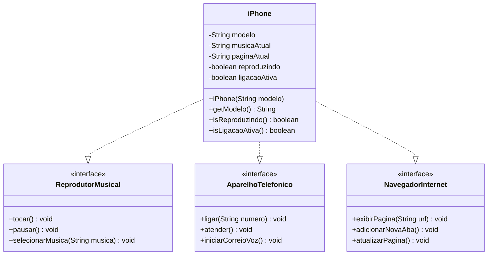

# 📱 iPhone 2007 - Recriando a Revolução

> *"Today, Apple is going to reinvent the phone"* - Steve Jobs, 9 de janeiro de 2007

Recriação das funcionalidades revolucionárias do primeiro iPhone usando **Programação Orientada a Objetos** em Java.

## 🎯 Sobre o Projeto

Este projeto recria as **3 funcionalidades principais** apresentadas por Steve Jobs no lançamento histórico do iPhone:

- 🎵 **iPod** - Reprodutor musical revolucionário
- 📞 **Phone** - Telefone móvel inteligente  
- 🌐 **Internet** - Navegador web no bolso

**Desafio:** Modelar e implementar usando interfaces Java e conceitos de POO.

## 🏗️ Diagrama UML



## ⚙️ Funcionalidades Implementadas

### 🎵 Reprodutor Musical (iPod)
- ✅ Seleção de músicas
- ✅ Controle play/pause
- ✅ Validação de estado
- ✅ Feedback com emojis

### 📞 Aparelho Telefônico (Phone)
- ✅ Realizar ligações
- ✅ Atender chamadas
- ✅ Correio de voz
- ✅ Controle de estado

### 🌐 Navegador Internet (Safari)
- ✅ Carregar páginas web
- ✅ Sistema de abas
- ✅ Atualizar páginas
- ✅ Navegação completa


## 🚀 Como Executar

### Pré-requisitos:
- Java JDK 8 ou superior
- IDE de sua preferência

### Passos:
``` bash
# 1. Clone ou baixe o projeto
# 2. Abra no IntelliJ/Eclipse/VS Code
# 3. Compile os arquivos
javac *.java
# 4. Execute o teste
java TesteiPhone
```
### Interface do Programa:
``` 
═══════════════════════════════════
           📱 iPhone 2007
═══════════════════════════════════
1. 🎵 Reprodutor Musical
2. 📞 Aparelho Telefônico  
3. 🌐 Navegador Internet
4. 🧪 Testar Tudo Automaticamente
0. ❌ Sair

```

## 📂 Estrutura do Projeto


📁 Projeto iPhone/

├── 📄 ReprodutorMusical.java     # Interface - Música

├── 📄 AparelhoTelefonico.java    # Interface - Telefone  

├── 📄 NavegadorInternet.java     # Interface - Internet

├── 📄 iPhone.java                # Classe principal

├── 📄 TesteiPhone.java           # Testes interativos

└── 📄 README.md                  # Documentação

```
```


## 🎓 Conceitos POO Aplicados
✅ **Abstração** - Interfaces bem definidas
✅ **Encapsulamento** - Atributos privados
✅ **Herança** - Implementação de interfaces
✅ **Polimorfismo** - iPhone como múltiplas interfaces

---

## 🛠️ Tecnologias

- **Java** - Linguagem principal
- **POO** - Programação Orientada a Objetos
- **UML** - Modelagem de classes
- **Git** - Controle de versão

## 🏆 Destaques do Projeto

- ✅ **Menu interativo** para demonstração
- ✅ **Validações inteligentes** de estado  
- ✅ **Interface amigável** com emojis
- ✅ **Código limpo** e bem estruturado
- ✅ **Testes completos** automatizados

## 👨‍💻 Autor

**Nicolly Morethes**
- 🌐 GitHub: [NickMorethes](https://github.com/NickMorethes)
- 💼 LinkedIn: [Nicolly Morethes](https://www.linkedin.com/in/nicolly-morethes-a20783143)
- 📧 Email: nrmorethes@outlook.com

## 📄 Licença

Este projeto está sob a licença MIT. Livre para usar e modificar.

---

**⭐ Se este projeto te ajudou, deixe uma estrela no GitHub!**

**Projeto desenvolvido para o Bootcamp Java da DIO** 🚀
```
